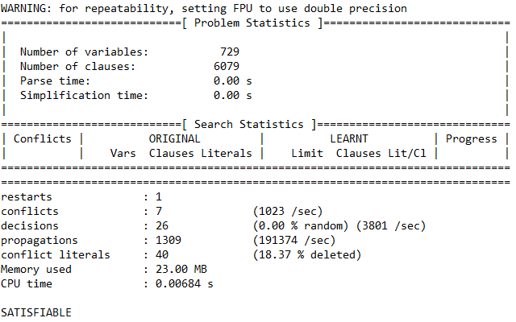
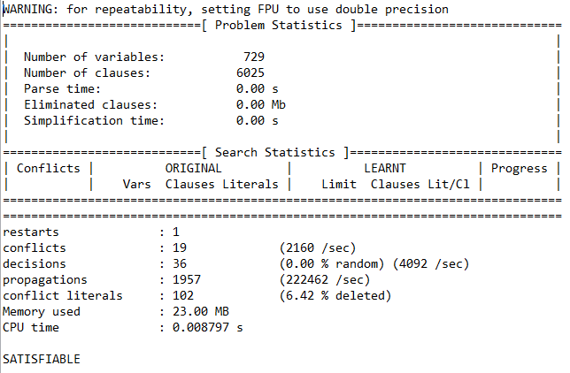
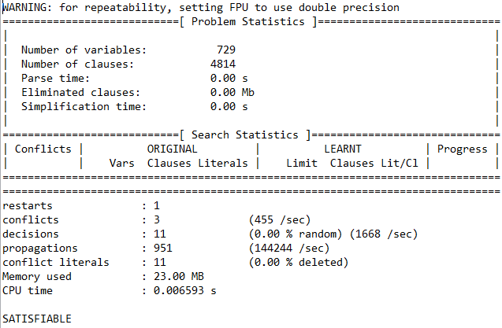
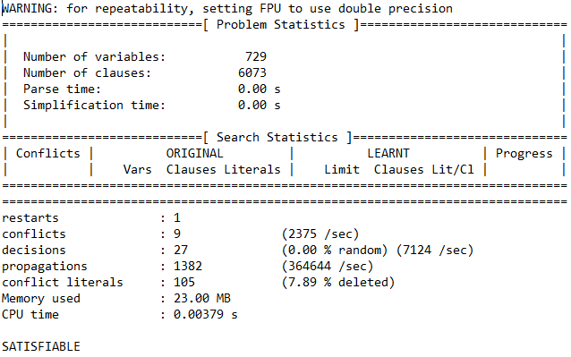
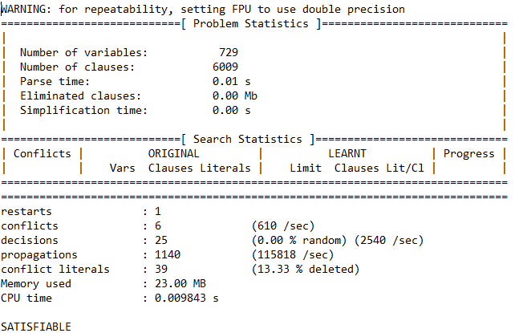

# Extended Puzzle Tests

sud2sat Input: 
        
    4.....8.5.3..........7......2.....6.....8.4......1.......6.3.7.5..2.....1.4......
    
sat2sud Output:

    417 369 825
    632 158 947
    958 724 316
    825 437 169
    791 586 432
    346 912 758
    289 643 571
    573 291 684
    164 875 293

minisat Statistics:

#

sud2sat Input: 
    
    48.3............71.2.......7.5....6....2..8.............1.76...3.....4......5....
        
sat2sud Output:

    487 312 695
    593 684 271
    126 597 384
    735 849 162
    914 265 837
    268 731 549
    851 476 923
    379 128 456
    642 953 718

minisat Statistics:

#

sud2sat Input: 

    .6.5.1.9.1...9..539....7....4.8...7.......5.8.817.5.3.....5.2............76..8...
    
sat2sud Output:

    863 521 794
    127 496 853
    954 387 621
    645 839 172
    739 142 568
    281 765 439
    498 653 217
    512 974 386
    376 218 945

minisat Statistics:

#

sud2sat Input: 

    3...8.......7....51..............36...2..4....7...........6.13..452...........8..
    
sat2sud Output:

    354 186 927
    298 743 615
    167 952 483
    481 527 369
    932 614 578
    576 398 241
    729 865 134
    845 231 796
    613 479 852

minisat Statistics:

# Second Task
- Modification: 
    - Within the simple rules, I disabled the following rule: "There is at least one number in each entry".
        - This rule will be re-enabled (uncommented) in the submission.
        - I disabled this rule as the extended rule "There is at most one number in each entry" is a tighter constraint
    and should provide identical solutions.
    
    
sud2sat Input: 
    
        3...8.......7....51..............36...2..4....7...........6.13..452...........8..
        
sat2sud Output:
    
        354 186 927
        298 743 615
        167 952 483
        481 527 369
        932 614 578
        576 398 241
        729 865 134
        845 231 796
        613 479 852
    
minisat Statistics:
    

- As predicted, the removal of the basic rule has reduced the CPU time required to solve this problem.
- Compared to our unmodified run:
    - ~64 less clauses
    - 3 additional conflicts
    - 2 additional decisions
    - ~300 additional propagations
    - ~20 additional conflict literals