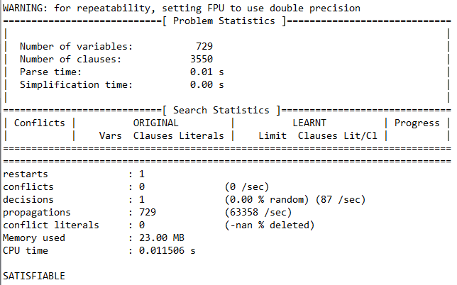
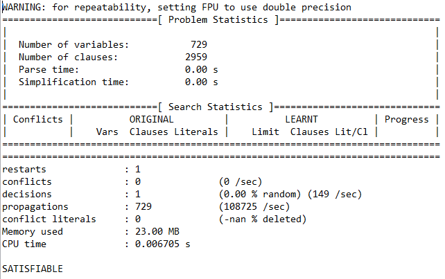
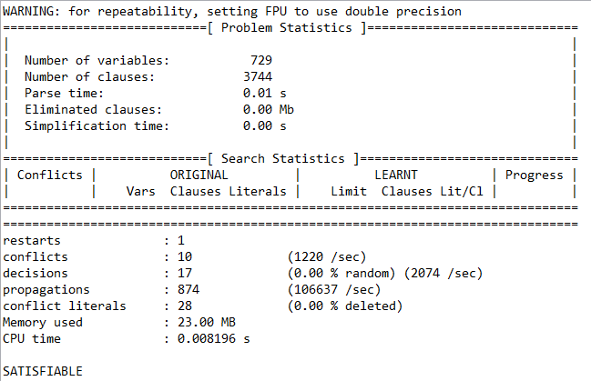
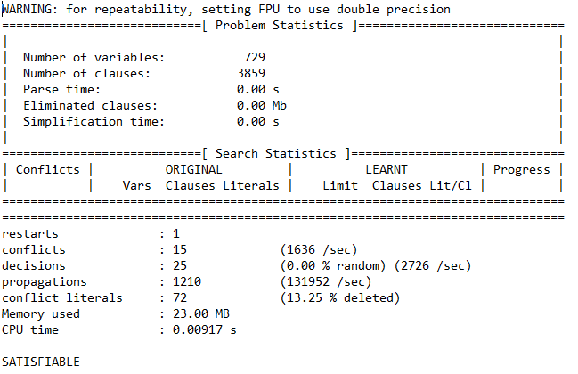

# Simple Puzzle Tests
sud2sat Input: 

    ...1.5...
    14....67.
    .8...24..
    .63.7..1.
    9.......3
    .1..9.52.
    ..72...8.
    .26....35
    ...4.9...
    
sat2sud Output:
 
    672 145 398
    145 983 672
    389 762 451
    263 574 819
    958 621 743
    714 398 526
    597 236 184
    426 817 935
    831 459 267
    
minisat Statistics:

#

sud2sat Input:

    003020600
    900305001
    001806400
    008102900
    700000008
    006708200
    002609500
    800203009
    005010300

sat2sud Output:

    483 921 657
    967 345 821
    251 876 493
    548 132 976
    729 564 138
    136 798 245
    372 689 514
    814 253 769
    695 417 382

minisat Statistics:

#

sud2sat Input:

    200080300
    060070084
    030500209
    000105408
    000000000
    402706000
    301007040
    720040060
    004010003

sat2sud Output:

    245 981 376
    169 273 584
    837 564 219
    976 125 438
    513 498 627
    482 736 951
    391 657 842
    728 349 165
    654 812 793

minisat Statistics:
 
 

#

sud2sat Input:

    000000907
    000420180
    000705026
    100904000
    050000040
    000507009
    920108000
    034059000
    507000000

sat2sud Output:

    462 831 957
    795 426 183
    381 795 426
    173 984 265
    659 312 748
    248 567 319
    926 178 534
    834 259 671
    517 643 892

minisat Statistics:

#

